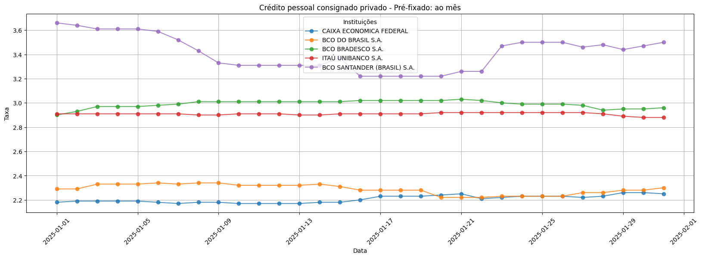
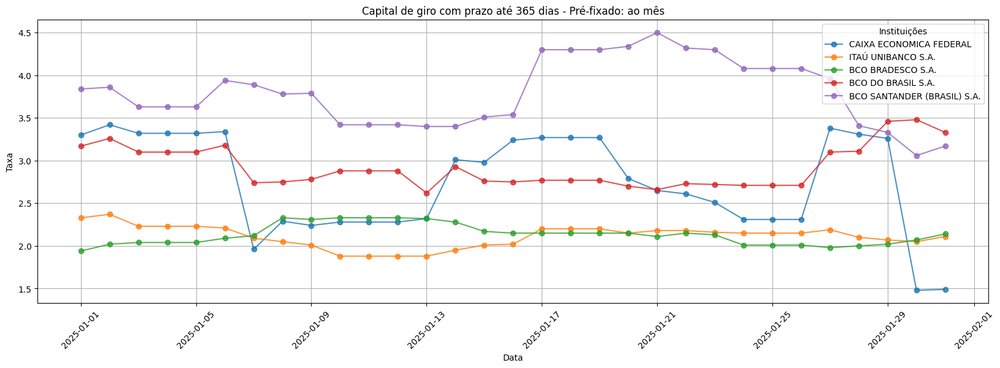

# ETL-BCB-DATA

Extraindo histórico de taxas de juros que cada banco ofertou em cada produto. 

</img>

</img>

Permite obter dados:

- Por **ano**;
- Por **mês** ou **range de meses**;
- Por **dia específico**;
- Em relação ao **dia atual**;


**Fonte dos dados:** Banco Central do Brasil.

## Tabelas

### Principal (Juros Mercado)

**FUNÇÃO:** Armazena as informações de taxas de juros praticadas pelo mercado financeiro para cada produto/modalidade.

- **Visão:** Modalidade
- **Chave:** NM_BANK + CD_MODL
- **Partição:** dat_ref_carga

<br/>

| Nome | Tipo | Descrição | Opções
| --- | --- | --- | --- |
| NM_BANK | string | Nome da instituição financeira | -
| NM_SEGM | string | Nome do segmento do produto | Pessoa Jurídica<br/>Pessoa Física
| DS_PROD | string | Descrição parametrizada do produto | -
| CD_SEGM | string | Código parametrizado do segmento do produto | 1 (PF)<br/>2 (PJ)
| CD_MODL | string | Código parametrizado da modalidade do produto | -
| NR_POSI | int | Posição do produto da instituição financeira em relação aos demais produtos. Ranqueado por taxa de juros em um período específico, em ordem crescente | -
| DS_MODL | string | Descrição da modalidade | -
| IN_INIC_PERI_EXAT | int | Indicador de taxa de juros encontrada na data alvo | 1 (SIM)<br/>2 (NÃO)
| DT_APROX | string | Data mais próxima da data alvo em que se encontrou a taxa de juros | -
| QT_DIA_APROX | int | Quantidade de dias em que a data foi aproximada | -
| VL_TAXA_JURO_AM | double | Valor da taxa de juros ao mês | -
| VL_TAXA_JURO_AA | double | Valor da taxa de juros ao ano | -
| dat_ref_carga | string | Data de referência da carga. É a data alvo em que se buscou a taxa de juros. | -
| dh_exec | timestamp | Data de execução/ingestão | -

---
### Produtos (Modalidades)

**FUNÇÃO:** Armazena os produtos/modalidades regulamentados pelo Banco Central e seus respectivos parâmetros.

- **Visão:** Modalidade
- **Chave:** CD_MODL
- **Partição:** dat_ref_carga

<br/>

| Nome | Tipo | Descrição | Opções
| --- | --- | --- | --- |
| CD_MODL | string | Código parametrizado da modalidade do produto | -
| DS_MODL | string | Descrição da modalidade | -
| CD_SEGM | string | Código parametrizado do segmento do produto | 1 (PF)<br/>2 (PJ)
| NM_BANK | string | Nome da instituição financeira | -
| NM_SEGM | string | Nome do segmento do produto | Pessoa Jurídica<br/>Pessoa Física
| TP_MODL | string | Tipo da modalidade | D (Diária)<br/>M (Mensal)
| DS_TIPO_PERI_MODL | string | Descrição do tipo de período da modalidade | Diária<br/>Mensal
| dat_ref_carga | string | Data de referência da carga | -
| dh_exec | timestamp | Data de execução/ingestão | -


---
### Períodos

**FUNÇÃO:** Armazena os períodos disponíveis e seus respectivos tipos para cada produto/modalidade.

- **Visão:** Período
- **Chave:** DT_INIC_PERI
- **Partição:** dat_ref_carga

<br/>

| Nome | Tipo | Descrição | Opções
| --- | --- | --- | --- |
| DS_PERI | string | Descrição do período | -
| DT_INIC_PERI | string | Data de início do período | Pessoa Jurídica<br/>Pessoa Física
| DT_FINA_PERI | string | Data final do período | -
| TP_MODL | string | Tipo da modalidade | D (Diária)<br/>M (Mensal)
| DS_TIPO_PERI_MODL | string | Descrição do tipo de período da modalidade | Diária<br/>Mensal
| dat_ref_carga | string | Data de referência da carga | -
| dh_exec | timestamp | Data de execução/ingestão | -
---

<br/>


## Dependências

- requests
- pyspark
- ipykernel
- pandas
- matplotlib


## Complicações

### Taxas de juros mais recentes do produto para a data alvo

Nas informações disponibilizadas pelo Banco Central do Brasil, é comum que algumas datas estejam presentes em múltiplos períodos ao mesmo tempo.

**Por exemplo:** A data específica <u>**25/03/2025**</u> está presente nos seguintes períodos: 
- ```24/03/2025 a 28/03/2025```
- ```21/03/2025 a 27/03/2025```
- ```20/03/2025 a 26/03/2025```
- ```19/03/2025 a 25/03/2025```

Neles, as taxas de juros estão diferentes para cada instituição financeira, o que gera o seguinte questionamento: **qual dos períodos contém a taxa exata praticada pelas instituições financeiras para a data alvo 25/03/2025?** 

Sem uma documentação, não há como responder com certeza, mas o fato é que é necessário mirar um período específico para cada data de modo a evitar dados duplicados. 

Para fazer isso, suponho alguns caminhos lógicos viáveis, documentados abaixo.


<details>
<summary><b>Lógica: <u>Taxa mais recente para a data alvo</u> (clique para expandir)</b></summary>

<br/>

Resumidamente, a lógica é: 

1. Assumir que o período que contém a data inicial mais recente dentre os períodos válidos seria o período a ser utilizado.
2. Assumir que o período que contém a data final mais próxima da data alvo dentre os períodos válidos seria o período a ser utilizado.
3. Caso não haja período com data inicial ou data final igual à data alvo, diminuir os dias da data alvo para encontrar o período com a data inicial mais próxima da data alvo.

----
Em outras palavras, se trata de:

### PASSO 1
**Tentar filtrar InicioPeriodo = dataAlvo**.
- ✅ **SUCESSO**: marcar flag IN_INIC_PERI_EXAT com 1, DT_APROX nulo, QT_DIA_APROX nulo - ```(EXEMPLO: 24/03/2025)```

- ❌ **FALHA**: Próximo passo.


### PASSO 2 
**Se InicioPeriodo = dataAlvo não trouxer resultado, então filtrar FimPeriodo = dataAlvo**.
- ✅ **SUCESSO**: marcar flag IN_INIC_PERI_EXAT com 0, DT_APROX com o valor do FimPeriodo, QT_DIA_APROX nulo  - ```(EXEMPLO: 25/03/2025)```

- ❌ **FALHA**: Próximo passo.


### PASSO 3 
**Se FimPeriodo = dataAlvo não trouxer resultado, então filtrar InicioPeriodo mais próximo da dataAlvo (limite de até 10 dias atrás)**.
- ✅ **SUCESSO**: marcar flag IN_INIC_PERI_EXAT com 0, DT_APROX com o valor do InicioPeriodo usado, QT_DIA_APROX será dataAlvo - DT_APROX - ```(EXEMPLO: 04/03/2025)```

- ❌ **FALHA**: Pular produto.

</details>